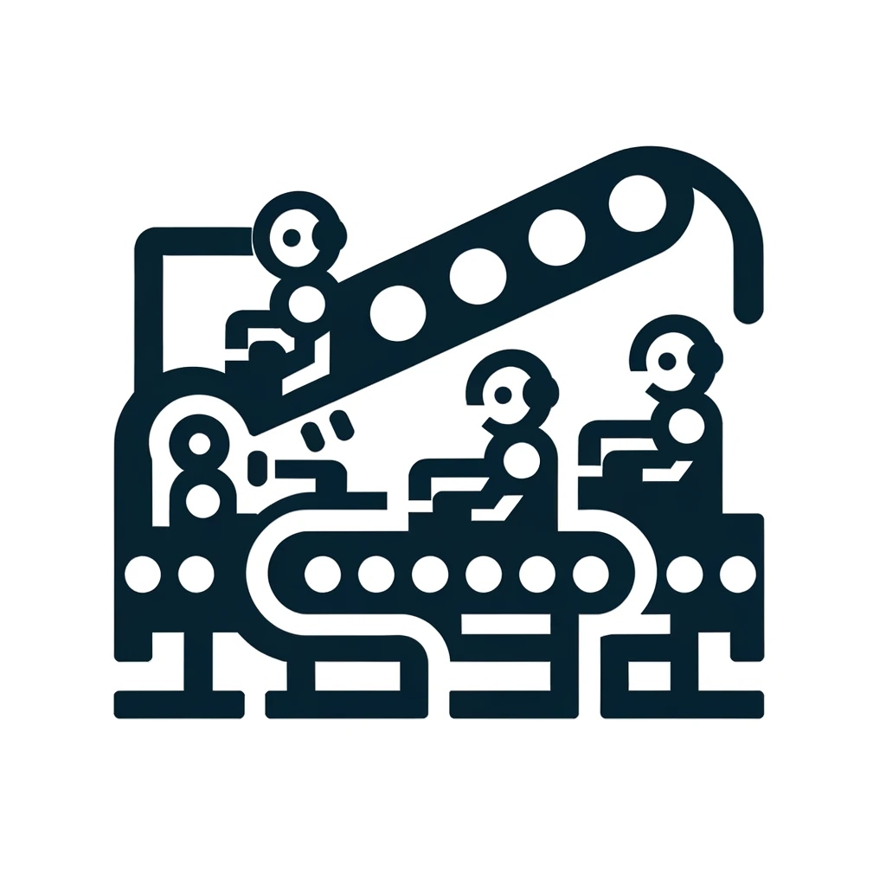
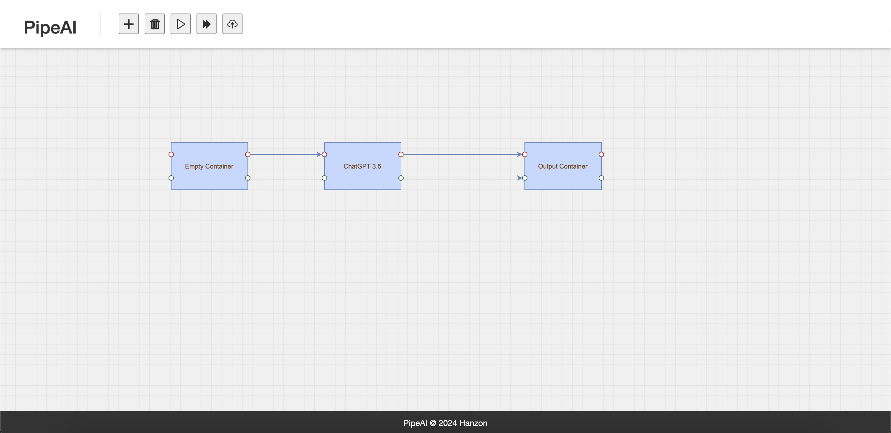

# Pipe AI
Use a pipeline to connect all AI platforms! 
No need to switch between different AI platforms, no need to learn how to use different AI platforms. What you need is just PipeAI.

## Dev Roadmap：
**Phase1 PipeAI includes：** 
- PipeAI Core: provide a unified dev API 
- Text: ChatGPT-3.5 ｜ChatGPT-4 
- Image: DELL-E | Stable-Diffusion | MidJourney 
- Video: Stable-Video-Diffusion 
- DB reader | Web crawler  
- Custom tool: like story auto-writing, prompt auto-writing.

**Phase2 PipeAI plan：** 
Better video generate suport(Pika & Runway, API not available for now) 
Local model (allow user connect to local models, or models in cloud env)

## Design (sketchy):
https://carpal-cornflower-8c1.notion.site/AI-Pipeline-Design-Doc-76dc31a2975e4417b6e7ee6bfcc1962f?pvs=4

UI Sketch:

